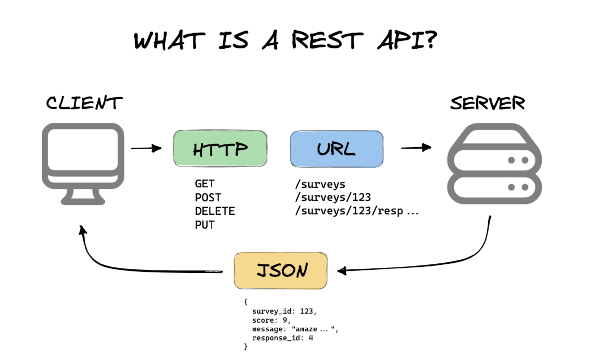

# Cviko 1

1. Treba chodit na prednasky lebo tam budu priklady čo budu na skúške. 
2. Treba sa pripojiť na teams.
3. Kto má už prvé zadanie hotové?
4. Kto bude robit v pythone a kto v niečom inom?

### Git

Git is a distributed version control system designed to handle everything from small to very large projects with speed and efficiency. It allows multiple developers to work together on a project, providing tools for branching, merging, and version-tracking of code changes. Git also ensures data integrity and supports non-linear development, enabling flexible workflows and fast handling of projects.

[github cheat sheet](https://education.github.com/git-cheat-sheet-education.pdf)

### Github

[GitHub](https://github.com/) is a web-based platform that provides hosting for version control using Git. It facilitates collaboration among developers, allowing them to share, manage, and track changes to their code in repositories. GitHub also offers features like issue tracking, code review, and integrations with various development tools, making it a central hub for software development projects.

### API 

An API, or Application Programming Interface, is a set of rules and protocols that allows different software applications to communicate with each other. In the context of backend (BE) and frontend (FE) development, the API serves as a bridge where the backend can securely provide data and functionality to the frontend, enabling user-facing applications to interact with backend logic and databases. This interaction facilitates the development of dynamic web and mobile applications, where the frontend can display and manipulate data without having to directly access the backend's internal workings.

#### REST

REST, which stands for Representational State Transfer, is an architectural style for designing networked applications. It relies on a stateless, client-server, cacheable communications protocol — typically HTTP. In REST, resources are manipulated using a set of well-defined operations by transferring representations of the resource state, such as using HTTP methods like GET, POST, PUT, and DELETE.

### Docker

Docker is a platform for developing, shipping, and running applications inside lightweight, portable containers. It allows developers to package an application with all of its dependencies into a standardized unit for software development, ensuring that it works seamlessly in any environment. Docker simplifies the management of microservices architectures, facilitates rapid deployment cycles, and improves consistency and efficiency across the software development lifecycle.

*check video bellow if you are lazy to read*

### CI/CD

CI/CD stands for Continuous Integration and Continuous Delivery/Deployment, which are practices in software development designed to improve code quality and expedite the release process. Continuous Integration (CI) involves automatically testing and building code changes, ensuring that new code integrates smoothly into the existing codebase. Continuous Delivery/Deployment (CD) automates the delivery of the tested code to staging or production environments, making it ready for release at any time. GitHub Actions is a CI/CD platform integrated into GitHub, allowing developers to automate their build, test, and deployment workflows directly within their GitHub repositories.

### Enviroment variables

Environment variables are key-value pairs that provide a way to influence the behavior of software on a computer. They can be used to store system-wide settings, such as paths to find executable files, or user-specific settings, like the current user's home directory. Environment variables offer a flexible method to configure the operating environments for applications without hard-coding values, making software more portable and easier to manage.