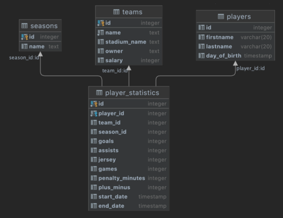

# Cviko 2


### Load data into db

Using SQL run all the commands from the file cvicenie2-hockey.sql




#### Uloha 1.

Vypíšte všetky mená hráčov. Pozn. Bez dátumu narodenia

```sql
SELECT firstname, lastname
FROM players;
```

#### Uloha 2.

Vypíšte názvy tímov, ktorých salary je väčší ako 70000

```sql
SELECT name
FROM teams
WHERE salary > 70000;
```

#### Uloha 3.

Vypíšte názvy tímov, ktorých salary je väčší ako 70000 a meno majiteľa je „Dusan“

```sql
SELECT name
FROM teams
WHERE salary > 70000 AND owner = 'Dusan';
```

#### Uloha 4.

Vypíšte mena a priezviska hráčov s počtom odohratých zápasov pre jednotlivé sezóny. Ak hráč neodohral žiadnu sezónu tak sa vo výpise nezobrazí a v prípade, že hráč nastupoval v rámci rovnakej sezóny za viacero klubov, tak to považujte ako dve rozdielne sezóny (nezaoberáte sa agregáciou daných záznamov do jedného).

```sql
SELECT *
FROM players as pl
JOIN player_statistics as ps ON pl.id = ps.player_id;
```

#### Uloha 5.

Vypíšte mena hráčov aj s názvom sezóny, v ktorých odohrali nejaký zápas.

```sql
SELECT pl.firstname, pl.lastname, s.name
FROM players AS pl
JOIN  player_statistics AS ps ON pl.id = ps.player_id
JOIN seasons as s ON s.id = ps.season_id
WHERE ps.games > 0 ;
```

#### Uloha 6.

Vypíšte mena hráčov, názov sezóny a počet bodov (góly + asistencie) pre jednotlivých hráčov, ktoré dosiahli v jednotlivých sezónach. Počet bodov pomenujte názvom „points“.

```sql
SELECT pl.firstname, pl.lastname, s.name, ps.assists+ps.goals as points
FROM players AS pl
JOIN player_statistics AS ps ON pl.id = ps.player_id 
JOIN seasons AS s ON s.id = ps.season_id ;
```

#### Uloha 7.

Úlohu 6 uskutočnite pre všetkých hráčov bez ohľadu na to ci odohrali nejakú sezónu. Ak neodohrali žiadnu sezónu v stĺpci points uveďte 0 a v stĺpci s názvom sezóna- „no season“

```sql
SELECT pl.firstname, pl.lastname, COALESCE(s.name,'no season'), COALESCE (ps.assists+ps.goals,0) AS points
FROM players AS pl 
LEFT JOIN  player_statistics as ps ON pl.id = ps.player_id
LEFT JOIN seasons AS s ON s.id = ps.season_id ;
```
alebo
```sql
SELECT pl.firstname, pl.lastname, COALESCE(s.name, 'no- season'), COALESCE(ps.goals + ps.assists, 0) as points FROM seasons as s
INNER JOIN player_statistics as ps
       ON s.id = ps.season_id
  RIGHT JOIN players as pl
       ON pl.id = ps.player_id;
```

#### Uloha 8.

Vypíšte mena hráčov s názvami tímov ,za ktoré hrali. V prípade ze hráč nehral za žiadny tím tak sa vo výsledku neobjaví.

```sql
SELECT DISTINCT pl.firstname, pl.lastname, t.name
FROM players AS pl
JOIN player_statistics AS ps ON pl.id = ps.player_id
JOIN teams as t ON t.id = ps.team_id;
```

#### Uloha 9.

Výsledok z 8 úlohy zoraďte podľa názvu tímu

```sql
SELECT DISTINCT pl.firstname, pl.lastname, t.name
FROM players AS pl
JOIN  player_statistics as ps ON pl.id = ps.player_id
JOIN teams AS t ON t.id = ps.team_id
ORDER BY t.name;
```

#### Uloha 10.

Vypíšte hráčov, ktorý neodohrali žiadnu sezónu.

```sql
SELECT DISTINCT pl.firstname, pl.lastname FROM players AS pl
LEFT JOIN  player_statistics AS ps ON pl.id = ps.player_id
WHERE ps.player_id is null;
```

#### Uloha 11.

Vypíšte mena hráčov s počtom bodov, gólov, asistencii, vypočítajte štatistiku bod na zápas (počet bodov / počet zápasov), +/- body a to všetko pre sezónu „2019-2020“. Výsledok zoraďte podľa počtu bodov zostupne a v prípade zhody použite druhy parameter počet gólov.

```sql
SELECT pl.firstname, pl.lastname, s.name, ps.assists+ps.goals as points, 
    COALESCE((ps.assists+ps.goals)/NULLIF(ps.games,0),0) AS "Points per game"
FROM players AS pl
JOIN player_statistics AS ps ON pl.id = ps.player_id
JOIN seasons AS s ON s.id = ps.season_id
WHERE s.name = '2019-2020'
ORDER BY points DESC, ps.goals DESC;
```

#### Uloha 12.

Vypíšte všetkých hráčov, ktorý hrali za klub, ktorý nesie v názve „Arizona“. Vo výsledku uveďte meno hráča, počet bodov a sezónu v ktorej hral za daný klub. Výsledok zoraďte podľa názvu sezóny.

```sql
SELECT pl.firstname, pl.lastname, s.name, ps.assists+ps.goals as points
FROM players AS pl
JOIN player_statistics AS ps ON pl.id = ps.player_id
JOIN seasons AS s ON s.id = ps.season_id
JOIN teams AS t ON t.id = ps.team_id
WHERE UPPER(t.name) LIKE '%ARIZONA%';
```

#### Uloha 13.

Vytvorte nového hráča s menom „Peter Forsberg“ s dátumom narodenia 20 Júla 1973 a id . Pre daného hráča vytvorte štatistiku pre sezónu 2000-2001 so štatistikami:

* Počet zápasov 73
* gólov 27
* asistencii 62
* +/- 0
* trestných minút 54
* Klub Colorado Avalanche

V prípade, že v DB chýba nejaký parameter, tak je ho potrebné doplniť do správnej tabuľky

```sql
INSERT INTO seasons(name)
VALUES ('2000-2001');
```

```sql
INSERT INTO players(firstname,lastname,day_of_birth)
VALUES ('Peter', 'Forsber','1973-7-20');
```

```sql
INSERT INTO seasons(name)
VALUES ('2000-2001');
```

```sql
INSERT INTO player_statistics(player_id, team_id, season_id, goals, assis ts, jersey, games, penalty_minutes, plus_minus, start_date, end_date)
VALUES (
    (
        SELECT id 
        FROM players 
        WHERE firstname = 'Peter' AND lastname = 'Forsberg' AND day_of_birth = '1973-7-  20'
    ), 
    (
        SELECT id 
        FROM teams 
        WHERE name='Colorado  Avalanche'
    ), 
    (
        SELECT id 
        FROM seasons 
        WHERE name='2000-2001'
    ), 
    27,63,0, 73, 54, 0,NULL,NULL
);
```

#### Uloha 14.

Aktualizujte štatistiku +/- pre Petra Forsberga na hodnotu 23.

```sql
UPDATE player_statistics
SET plus_minus = 23
WHERE player_id = (
    SELECT id
    FROM players
    WHERE firstname = 'Peter' AND lastname = 'Forsberg' and
    day_of_birth = '1973-7-20'
);
```

#### Uloha 15.

Vymažte hráča Petra Forsberga z DB.

```sql
DELETE FROM player_statistics
WHERE player_id = (
    SELECT id 
    FROM players 
    WHERE firstname = 'Peter' AND lastname = 'Forsberg' and day_of_birth = '1973- 7-20'
);
```

```sql
DELETE FROM players
WHERE firstname = 'Peter' AND lastname = 'Forsberg' and day_of_birth = '1973-7-20';
```


