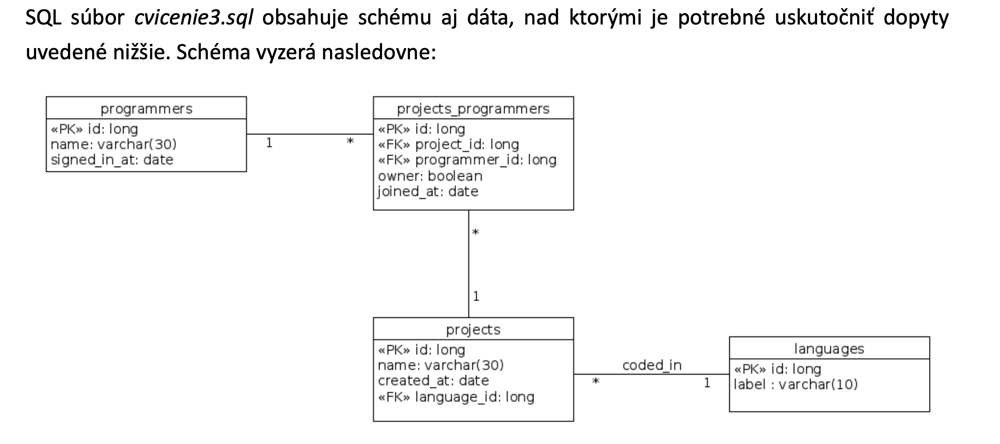

# Cviko 3 - DB Queries

### Load data into db




#### Uloha 1.

Napíšte SELECT, ktorý vráti mená a dátumy registrácie všetkých programátorov.

```sql
SELECT name, signed_in_at FROM programmers
```

#### Uloha 2.

Napíšte SELECT, ktorý vráti mená a dátumy registrácie všetkých programátorov, ktorých mená začínajú na písme no R.

```sql
SELECT name, signed_in_at
FROM programmers
WHERE name LIKE 'R%'
```

#### Uloha 3.

Napíšte SELECT, ktorý vráti meno a dátum registrácie najnovšieho programátora, ktorého meno začína na písmeno R. Hint: limit.

```sql
SELECT name, signed_in_at
FROM programmers
WHERE name LIKE 'R%'
ORDER BY signed_in_at DESC LIMIT 1
```

#### Uloha 4.

Napíšte SELECT, ktorý vráti mená všetkých programátorov, ktorí majú meno kratšie ako 12 znakov.

```sql
SELECT name
FROM programmers
WHERE char_length(name) < 12
```

#### Uloha 5.

Napíšte SELECT, ktorý vráti mená všetkých programátorov, pričom tí, ktorí majú meno dlhšie ako 12 znakov ho budú mať skrátené na 12 znakov.

```sql
SELECT left(name, 12)
FROM programmers
```

#### Uloha 6.

Napíšte SELECT, ktorý vráti mená všetkých programátorov vypísané naopak a veľkými písmenami.

```sql
SELECT upper(reverse(name))
FROM programmers
```

#### Uloha 7.

Napíšte SELECT, ktorý vráti len prvé slovo z mien všetkých programátorov.

```sql
SELECT split_part(name, ' ', 1) FROM programmers
```

#### Uloha 8.

Napíšte SELECT, ktorý vráti mená a dátumy registrácie všetkých programátorov, ktorí sa zaregistrovali v roku 2016.

```sql
SELECT name, signed_in_at
FROM programmers
WHERE date_part('year', signed_in_at) = 2016
```

#### Uloha 9.

Napíšte SELECT, ktorý vráti mená a dátumy registrácie všetkých programátorov, ktorí sa zaregistrovali vo februári roku 2016.

```sql
SELECT name, signed_in_at
FROM programmers
WHERE date_part('year', signed_in_at) = 2016 AND date_part('month', signed_in_at) = 02
```

#### Uloha 10.

Napíšte SELECT, ktorý vráti mená všetkých programátorov a počet dní medzi dátumom ich registrácie a prvým aprílom 2016S usporiadaný od najmenšieho po najväčší.

```sql
SELECT name,
abs(signed_in_at - DATE '2016-04-01') AS pocet_dni
FROM programmers
ORDER BY pocet_dni ASC
```

#### Uloha 11.

Napíšte SELECT, ktorý vráti label všetkých jazykov, ktoré majú aspoň jeden projekt.

```sql
SELECT DISTINCT label FROM languages l
JOIN projects p
ON l.id = p.language_id
```

#### Uloha 12.

Napíšte SELECT, ktorý vráti label všetkých jazykov, ktoré majú aspoň jeden projekt, ktorý začal v roku 2014.

```sql
SELECT DISTINCT label
FROM languages l
JOIN projects p
ON p.language_id = l.id
WHERE date_part('year', created_at) = 2014
```

#### Uloha 13.

Napíšte SELECT, ktorý vráti mená všetkých projektov, na ktorých sa programuje v jazykoch ruby alebo python (Hint: IN).

```sql
SELECT name
FROM projects p
JOIN languages l
ON p.language_id = l.id
WHERE l.label IN ('ruby', 'python')
```

#### Uloha 14.

Napíšte SELECT, ktorý vráti mená všetkých python programátorov.

```sql
SELECT DISTINCT p.name FROM programmers AS p JOIN projects_programmers AS pp
ON p.id = pp.programmer_id
JOIN projects AS pr
ON pp.project_id = pr.id
JOIN languages AS l
ON pr.language_id = l.id WHERE l.label = 'python';
```

#### Uloha 15.

Napíšte SELECT, ktorý vráti mená všetkých python programátorov, ktorí sú vlastníkmi (hoc aj nepython) projektu

```sql
SELECT DISTINCT programmers.name
FROM projects
JOIN projects_programmers ON project_id = projects.id JOIN programmers ON programmer_id = programmers.id WHERE language_id IN (
   SELECT id
   FROM languages
   WHERE label = 'python'
) AND programmers.id IN( SELECT programmer_id FROM projects_programmers WHERE owner = TRUE)
```


