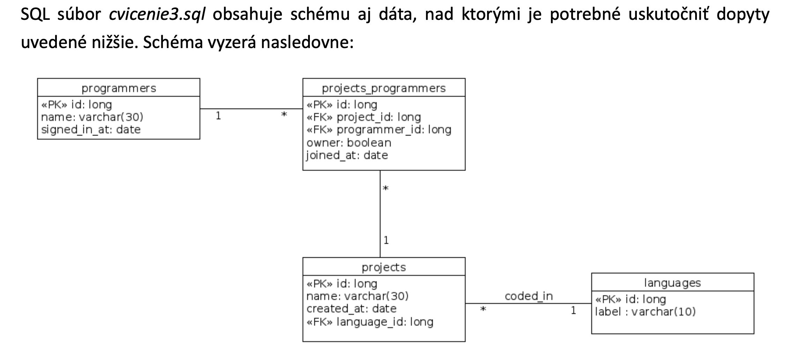

# Cviko 4 - DB Queries

### Load data into db




#### Uloha 1.

Napíšte SELECT, ktorý vráti priemerný počet dní (zaokrlúhené na celé čísla), ktoré sú všetci programátori registrovaní v našej databáze.

```sql
```

#### Uloha 2.

Napíšte SELECT, ktorý vráti celkový počet dní, ktoré sú ruby programátori registrovaní v našej databáze.

```sql
SELECT sum(days) FROM (
SELECT DISTINCT p.id, (current_date - signed_in_at) as days
FROM programmers as p
JOIN projects_programmers as pp
ON pp.programmer_id = p.id
JOIN projects as pr
ON pr.id = pp.project_id
JOIN languages as l
ON pr.language_id = l.id
WHERE l.label = 'ruby') as t;
```

#### Uloha 3.

Napíšte SELECT, ktorý vráti meno projektu a počet programátorov, ktorí na ňom pracujú

```sql
SELECT p.name, count(pp.programmer_id) FROM projects as p LEFT JOIN projects_programmers as pp
ON p.id = pp.project_id
GROUP BY p.name;
-ziskame aj project kde pracuje 0 ludi
```

#### Uloha 4.

Napíšte SELECT, ktorý vráti meno projektu a celkový počet dní, ktoré na ňom programátori odrobili (predpokladajme, že od okamihu kedy sa pridali k projektu už na ňom robia každý deň).

```sql
SELECT pr.name, COALESCE (sum((current_date - pp.joined_at)),0) FROM projects as pr
LEFT JOIN projects_programmers as pp
ON pr.id = pp.project_id
GROUP BY pr.name;
```

#### Uloha 5.

Napíšte SELECT, ktorý vráti meno projektu, na ktorom pracuje najviac programátorov. Ak je takýchto projektov viac, tak uplatnite lexikografické radenie a vypíšte prvý.

```sql
SELECT p.name FROM projects as p
LEFT JOIN projects_programmers as pp
ON p.id = pp.project_id
GROUP BY p.name
HAVING count(pp.programmer_id) = (SELECT max(t.count) FROM (SELECT count(*) as count FROM projects_programmers as pp
GROUP BY pp.project_id) as t) ORDER BY p.name
LIMIT 1;
```

#### Uloha 6.

Napíšte SELECT, ktorý vráti meno projektu, na ktorom pracuje najviac programátorov. Ak je takýchto projektov viac, tak vypíšte mená všetkých

```sql
SELECT p.name FROM projects as p
LEFT JOIN projects_programmers as pp
ON p.id = pp.project_id
GROUP BY p.name
HAVING count(pp.programmer_id) = (SELECT max(t.count) FROM (SELECT count(*) as count FROM projects_programmers as pp
GROUP BY pp.project_id) as t);
```

#### Uloha 7.

Napíšte SELECT, ktorý vráti meno každého programovacieho jazyka spolu s počtom programátorov, ktorí ho používajú. Zoradené od najväčšieho po najmenší.

```sql
SELECT l.label, count(pr.id) as people FROM languages as l LEFT JOIN projects as pr
ON l.id = pr.language_id
LEFT JOIN projects_programmers as pp
ON pr.id = pp.project_id GROUP BY l.id
ORDER BY people DESC;
```

#### Uloha 8.

Napíšte SELECT, ktorý vráti meno každého programovacieho jazyka spolu s menom najstaršieho projektu pre tento programovací jazyk. Tie jazyky, ktoré nemajú žiadny projekt, nech majú namiesto projektu uvedené 'no project yet'.

```sql
SELECT t_rank.label,COALESCE(t_rank.name,'No project yet') FROM ( SELECT t.label,t.name, rank() OVER (PARTITION BY t.label ORDER BY t.created_at)
FROM (
SELECT l.label, pr.id, pr.name, pr.created_at FROM languages as l
LEFT JOIN projects as pr
ON l.id = pr.language_id) as t) as t_rank WHERE t_rank.rank = 1;
```

#### Uloha 9.

Napíšte SELECT, ktorý vráti meno každého programovacieho jazyka spolu s počtom projektov, v ktorých je jazyk použitý. Zoradené od najväčšieho po najmenší, v prípade rovnakého počtu projektov nech sú jazyky radené lexikograficky. Skúste v zoradení použiť index stĺpca miesto jeho názvu.

```sql
SELECT l.label, count(pr.id) FROM languages as l LEFT JOIN projects as pr
ON l.id = pr.language_id
GROUP BY l.id
ORDER BY 2 DESC, 1 ASC;
```


