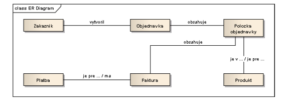
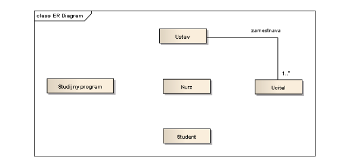
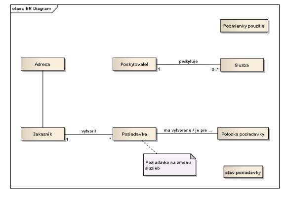
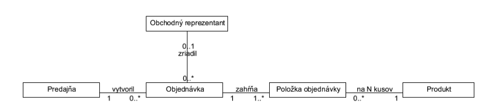

# Cviko 5 - Dátové modelovanie

#### Uloha 1.

Pre nasledujúce príklady E-R diagramy a určite kardinalitu.

1. Oddelenie zamestnáva osoby. Osoba je zamestnaná najviac v jednom oddelení.
2. Manažér riadi najviac jedno oddelenie. Oddelenie je riadené najviac jedným manažérom.
3. Autor môže napísať veľa článkov. Veľa článkov môže byť napísaných viacerými autormi. Autor článku môže byť neznámy.
4. Tím je zložený z viacerých hráčov. Hráč hrá iba za jeden tím. Osoba, ktorá nehrá za tím nie je hráč.
5. Produkt patrí do viacerých kategórií. Kategória obsahuje veľa produktov. Produkt nemôže existovať bez kategórie.
6. Konkrétny produkt sa predáva v najviac jednej krajine. V krajine sa predáva veľa produktov.

#### Uloha 2.

V nasledovných diagramoch vysvetlite kardinalitu vzťahov medzi entitami. Určte, ktorý z týchto vzťahov je typu 1:1 a vysvetlite, prečo je vždy potrebné zvážiť vhodnosť použitia takéhoto typu vzťahu. Vysvetlite, akým typom vzťahu by ho bolo vhodné v tomto prípade nahradiť, a prečo.

#### Uloha 3.

Doplňte do E-R diagramu kardinalitu medzi entitami.

#### Uloha 4.

Fakulta pozostáva z ústavov a každý ústav ponúka niekoľko študijných programov. Každý študijný program ponúka niekoľko kurzov (predmetov) zameraných na určitú problematiku. Študenti sa zapisujú na konkrétny študijný program, v ktorom musia absolvovať predpísané kurzy. Každý kurz je vyučovaný učiteľom (učiteľmi), pričom učiteľ je zamestnancom konkrétneho ústavu.
- Doplňte vzťahy, kardinalitu a odôvodnite existenciu vzťahov
- Tento model je až príliš zjednodušený. Identifikujte jeho nedostatky.

#### Uloha 5.

Doplňte chýbajúce vzťahy medzi entitami a opravte kardinalitu vo vytvorených vzťahoch (ak je potrebné):

#### Uloha 6.

Doplňte logický model distribúcie vo farmaceutickej firme tak, aby zahŕňal:
- Evidenciu zásielok tovaru, pričom každú objednávku musí byť možné rozdeliť na viac
zásielok pokiaľ si to odoberateľ želá.
- Evidenciu jázd obchodného reprezentanta. Pre každú jazdu farmaceutickú spoločnosť
zaujíma množstvo spotrebovaného paliva a navštívené predajne.
- Zmeniť mapovanie vytvorených objednávok na zodpovedného obchodného reprezentanta z priameho, na založené na regióne, v ktorom sa predajňa nachádza a reprezentant ho má na starosti

#### Uloha 7.

Regionálny autobusový dopravca vlastní niekoľko autobusov. Každý autobus je priradený na určitú trasu, avšak niektoré trasy môžu vyžadovať priradenie viacerých autobusov. Každá trasa prechádza niekoľkými mestami a je vytvorená z jedného alebo viacerých úsekov. Jeden úsek zahŕňa niekoľko miest (všetky úseky tvoria trasu). Šofér autobusu môže byť priradený na jeden alebo viac úsekov (na konci úseku sa napr. môžu šoféri striedať). V niektorých mestách je situovaná garáž pre autobusy. Identifikujte entity, vzťahy medzi entitami a nakreslite logický dátový model.

#### Uloha 8.

Vydavateľská spoločnosť produkuje vedecké publikácie (knihy) na rôzne témy. Publikácie sú zamerané predovšetkým na jednu odbornú tému a sú napísané jediným autorom, ktorý sa špecializuje na konkrétnu tému. Spoločnosť zamestnáva editorov, ktorí majú výhradnú zodpovednosť za editáciu aspoň jednej publikácie. Títo editori nemusia byť nutne odborníci na danú problematiku, a preto sa pre zvýšenie kvality snažia najímať iných autorov v roli recenzentov. Tí sú špecialistami na odborné témy, pričom na jednu tému najíma editor viacero recenzentov. Pri písaní publikácie je autor pod dohľadom týchto recenzentov. Identifikujte entity, vzťahy medzi entitami a nakreslite logický dátový model.

#### Uloha 9.

Všeobecná nemocnica sa skladá z niekoľkých špecializovaných izieb (napr. pediatrické oddelenie, onkologické oddelenie). Na každej izbe je určitý počet pacientov, ktorí boli prijatí na odporúčanie ich všeobecného lekára a konzultanta (doktor) zamestnaného nemocnicou. Vykonané testy a výsledky predpísanej liečby sú zaznamenávané v samostatnej evidencii. Každý pacient sa môže podrobiť viacerým testom. Je mu priradený jeden osobný konzultant, ale ak je potrebné, môže byť vyšetrený viacerými doktormi s cieľom stanoviť (určiť) diagnózy. Doktor je špecialista v určitom odbore medicíny a môže byť vedúci konzultant pre niekoľkých pacientov súčasne a nie nutne na rovnakom oddelení. Pre pacienta navrhuje liečbu (liečby) doktor. Identifikujte entity, vzťahy medzi entitami a nakreslite logický dátový model.

#### Uloha 10.

Centrum voľného času (ďalej CVČ) organizuje detské krúžky s rôznym zameraním (šachový, futbalový, plavecký atď.). Stretnutia krúžkov sa počas jedného sa kurzu konajú vždy každý týždeň pravidelne. V prípade veľkého záujmu o niektoré krúžky CVČ tiež zvykne organizovať viacero rovnakých kurzov o rôznych časoch, prípadne aj naraz. Po tom čo sa otvorí prázdny kurz, je možné sa naň zapísať. Rodičia môžu zapísať svoje deti na koľko krúžkov len chcú. Za kurz sa vždy CVČ platí dopredu prostredníctvom platbou z účtu. Vedenie CVČ sa pri evidovaní platieb nezaujíma o vlastníka účtu, pokiaľ je kurz riadne zaplatený. Každý kurz vedie vždy minimálne jeden inštruktor. Inštruktori zvyknú tiež viesť viacero kurzov, samozrejme pokiaľ sa im pri tom nekolidujú termíny. Kurzom ktoré si to vyžadujú CVČ priraďuje v rozvrhu vhodné priestory, v ktorých sa môžu do plnej miery venovať svojim aktivitám (miestnosť, ihrisko, plavecká dráha atď.). Niekedy môže rovnaké priestory zdieľať aj viacero kurzov. Identifikujte entity, vzťahy medzi entitami a nakreslite ER diagram.