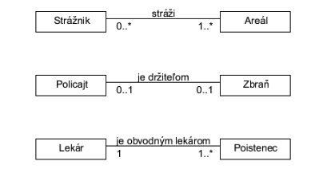

# Cviko 5 - Dátové modelovanie

#### Úloha 1.

Pre nasledujúce príklady E-R diagramy a určite kardinalitu.

1. **Oddelenie zamestnáva osoby. Osoba je zamestnaná najviac v jednom oddelení.**
    - Entita: Oddelenie, Osoba
    - Vzťah: Zamestnáva
    - Kardinalita: 1:N (Jedno oddelenie môže zamestnávať viacero osôb, ale osoba je zamestnaná najviac v jednom oddelení.)
2. **Manažér riadi najviac jedno oddelenie. Oddelenie je riadené najviac jedným manažérom.**
    - Entita: Manažér, Oddelenie
    - Vzťah: Riadi
    - Kardinalita: 1:1 (Jeden manažér riadi najviac jedno oddelenie a jedno oddelenie je riadené najviac jedným manažérom.)
3. **Autor môže napísať veľa článkov. Veľa článkov môže byť napísaných viacerými autormi. Autor článku môže byť neznámy.**
    - Entita: Autor, Článok
    - Vzťah: Napíše
    - Kardinalita: M:N (Autor môže napísať viacero článkov a jeden článok môže byť napísaný viacerými autormi. Prítomnosť neznámeho autora naznačuje, že nie je potrebné, aby každý článok mal priradeného autora.)
4. **Tím je zložený z viacerých hráčov. Hráč hrá iba za jeden tím. Osoba, ktorá nehrá za tím nie je hráč.**
    - Entita: Tím, Hráč
    - Vzťah: Zložený z
    - Kardinalita: 1:N (Jeden tím je zložený z viacerých hráčov, ale hráč hrá iba za jeden tím.)
5. **Produkt patrí do viacerých kategórií. Kategória obsahuje veľa produktov. Produkt nemôže existovať bez kategórie.**
    - Entita: Produkt, Kategória
    - Vzťah: Patrí do
    - Kardinalita: M:N (Jeden produkt môže patriť do viacerých kategórií a jedna kategória môže obsahovať viacero produktov. Podmienka, že produkt nemôže existovať bez kategórie, naznačuje silnú závislosť produktu na kategórii.)
6. **Konkrétny produkt sa predáva v najviac jednej krajine. V krajine sa predáva veľa produktov.**
    - Entita: Produkt, Krajina
    - Vzťah: Predáva sa v
    - Kardinalita: 1:N (Jeden produkt sa predáva v najviac jednej krajine, ale v jednej krajine sa môže predávať veľa produktov.)

#### Úloha 2.

V nasledovných diagramoch vysvetlite kardinalitu vzťahov medzi entitami. Určte, ktorý z týchto vzťahov je typu 1:1 a vysvetlite, prečo je vždy potrebné zvážiť vhodnosť použitia takéhoto typu vzťahu. Vysvetlite, akým typom vzťahu by ho bolo vhodné v tomto prípade nahradiť, a prečo.

1. **Strážnik a Areál:**
    - Kardinalita: 0..* : 1..*
    - Vzťah: "stráži"
    - Tento vzťah naznačuje, že jeden strážnik môže strážiť žiadny alebo viacero areálov, a jeden areál môže byť strážený žiadnym alebo viacerými strážnikmi. To je príklad M:N vzťahu, kde M a N môžu byť 0 alebo väčšie.

2. **Policajt a Zbraň:**
    - Kardinalita: 0..1 : 0..1
    - Vzťah: "je držiteľom"
    - Tento vzťah je 1:1, pretože jeden policajt môže byť držiteľom najviac jednej zbrane a jedna zbraň môže byť priradená najviac jednému policajtovi. Tento typ vzťahu je vždy potrebné zvážiť, pretože môže byť príliš obmedzujúci – v skutočnom svete môže byť situácií, kedy policajt môže mať viac ako jednu služobnú zbraň, alebo jedna zbraň môže byť postupne používaná rôznymi policajtmi. Ak je tento 1:1 vzťah príliš reštriktívny, mohol by byť nahradený vzťahom 1:N alebo M:N, aby odzrkadlil skutočnosť, že policajti môžu mať viacero zbraní alebo zbraň môže byť používaná viacerými policajtmi.
3. **Lekár a Poistenec:**
    - Kardinalita: 1 : 1..*
    - Vzťah: "je obvodným lekárom"
    - Tento vzťah naznačuje, že každý lekár je obvodným lekárom pre jedného alebo viacero poistencov, a každý poistenec má priradeného práve jedného obvodného lekára. Toto je príklad 1:N vzťahu, kde jeden lekár má priradených viacero poistencov, ale každý poistenec má len jedného lekára.
#### Úloha 3.

Doplňte do E-R diagramu kardinalitu medzi entitami.

#### Úloha 4.

Fakulta pozostáva z ústavov a každý ústav ponúka niekoľko študijných programov. Každý študijný program ponúka niekoľko kurzov (predmetov) zameraných na určitú problematiku. Študenti sa zapisujú na konkrétny študijný program, v ktorom musia absolvovať predpísané kurzy. Každý kurz je vyučovaný učiteľom (učiteľmi), pričom učiteľ je zamestnancom konkrétneho ústavu.
- Doplňte vzťahy, kardinalitu a odôvodnite existenciu vzťahov
- Tento model je až príliš zjednodušený. Identifikujte jeho nedostatky.

#### Úloha 5.

Doplňte chýbajúce vzťahy medzi entitami a opravte kardinalitu vo vytvorených vzťahoch (ak je potrebné):

#### Úloha 6.

Doplňte logický model distribúcie vo farmaceutickej firme tak, aby zahŕňal:
- Evidenciu zásielok tovaru, pričom každú objednávku musí byť možné rozdeliť na viac
zásielok pokiaľ si to odoberateľ želá.
- Evidenciu jázd obchodného reprezentanta. Pre každú jazdu farmaceutickú spoločnosť
zaujíma množstvo spotrebovaného paliva a navštívené predajne.
- Zmeniť mapovanie vytvorených objednávok na zodpovedného obchodného reprezentanta z priameho, na založené na regióne, v ktorom sa predajňa nachádza a reprezentant ho má na starosti

#### Úloha 7.

Regionálny autobusový dopravca vlastní niekoľko autobusov. Každý autobus je priradený na určitú trasu, avšak niektoré trasy môžu vyžadovať priradenie viacerých autobusov. Každá trasa prechádza niekoľkými mestami a je vytvorená z jedného alebo viacerých úsekov. Jeden úsek zahŕňa niekoľko miest (všetky úseky tvoria trasu). Šofér autobusu môže byť priradený na jeden alebo viac úsekov (na konci úseku sa napr. môžu šoféri striedať). V niektorých mestách je situovaná garáž pre autobusy. Identifikujte entity, vzťahy medzi entitami a nakreslite logický dátový model.

**Entity:**
- Autobus - zariadenie, ktoré dopravca vlastní a ktoré je používané na prepravu.
- Trasa - cesta, po ktorej autobus cestuje.
- Mesto - geografická lokalita, ktorou trasa prechádza.
- Úsek - časť trasy medzi dvoma mestami.
- Šofér - osoba, ktorá riadi autobus.
- Garáž - miesto, kde sú autobusy umiestnené, keď nie sú v používaní.

**Vzťahy:**

- Autobus-Trasa: 
    - Každý autobus je priradený k práve jednej trase, ale na každej trase môže byť priradených viac autobusov.
    - Vzťah: 1:N (Autobus:Trasa)
- Trasa-Mesto: 
    - Každá trasa prechádza cez jedno alebo viacero miest.
    - Vzťah: 1:N (Trasa:Mesto)
- Trasa-Úsek: 
    - Každá trasa je vytvorená z jedného alebo viac úsekov.
    - Vzťah: 1:N (Trasa:Úsek)
- Úsek-Mesto: 
    - Každý úsek zahŕňa viacero miest.
    - Vzťah: 1:N (Úsek:Mesto)
- Šofér-Úsek: 
    - Každý šofér môže byť priradený k jednému alebo viac úsekom.
    - Vzťah: N:N (Šofér:Úsek), pretože šofér môže šoférovať na viacerých úsekoch a úsek môže byť riadený rôznymi šoférmi.
- Garáž-Mesto:
    - V niektorých mestách je garáž.
    - Vzťah: 1:N (Mesto:Garáž), pretože v jednom meste môže byť viacero garáží, ale každá garáž je v jednom špecifickom meste.

#### Úloha 8.

Vydavateľská spoločnosť produkuje vedecké publikácie (knihy) na rôzne témy. Publikácie sú zamerané predovšetkým na jednu odbornú tému a sú napísané jediným autorom, ktorý sa špecializuje na konkrétnu tému. Spoločnosť zamestnáva editorov, ktorí majú výhradnú zodpovednosť za editáciu aspoň jednej publikácie. Títo editori nemusia byť nutne odborníci na danú problematiku, a preto sa pre zvýšenie kvality snažia najímať iných autorov v roli recenzentov. Tí sú špecialistami na odborné témy, pričom na jednu tému najíma editor viacero recenzentov. Pri písaní publikácie je autor pod dohľadom týchto recenzentov. Identifikujte entity, vzťahy medzi entitami a nakreslite logický dátový model.

**Entity:**
- Publikácia - Reprezentuje knihu alebo vedeckú prácu na konkrétnu tému.
- Autor - Osoba, ktorá napíše publikáciu. Špecializuje sa na konkrétnu odbornú tému.
- Editor - Zamestnanec vydavateľskej spoločnosti, ktorý má na starosti editáciu publikácií. Nemusí byť odborníkom na tému.
- Recenzent - Odborník na konkrétnu tému, ktorý hodnotí a poskytuje spätnú väzbu na publikáciu.

**Vzťahy:**
- Publikácia-Autor: 
    - Jedna publikácia je napísaná jedným autorom. 
    - Autor môže napísať viacero publikácií. (1:N)
- Publikácia-Editor: 
    - Každá publikácia má prideleného jedného editora, ale jeden editor môže mať na starosti viacero publikácií. (1:N)
- Publikácia-Recenzent: 
    - Každá publikácia môže mať viacerých recenzentov. 
    - Recenzent môže hodnotiť viacero publikácií. (M:N)

#### Úloha 9.

Všeobecná nemocnica sa skladá z niekoľkých špecializovaných izieb (napr. pediatrické oddelenie, onkologické oddelenie). Na každej izbe je určitý počet pacientov, ktorí boli prijatí na odporúčanie ich všeobecného lekára a konzultanta (doktor) zamestnaného nemocnicou. Vykonané testy a výsledky predpísanej liečby sú zaznamenávané v samostatnej evidencii. Každý pacient sa môže podrobiť viacerým testom. Je mu priradený jeden osobný konzultant, ale ak je potrebné, môže byť vyšetrený viacerými doktormi s cieľom stanoviť (určiť) diagnózy. Doktor je špecialista v určitom odbore medicíny a môže byť vedúci konzultant pre niekoľkých pacientov súčasne a nie nutne na rovnakom oddelení. Pre pacienta navrhuje liečbu (liečby) doktor. Identifikujte entity, vzťahy medzi entitami a nakreslite logický dátový model.

**Entity:**
- Oddelenie
- Pacient
- Doktor (Konzultant)
- Test
- Liečba
- Evidencia

**Vzťahy:**
- Pacient - Oddelenie:
    - Každý pacient je priradený k určitému oddeleniu. 
    - Tento vzťah môže byť zaznamenaný ako atribút v entite Pacient alebo cez medzitabuľku, ak chceme zaznamenať históriu premiestnení pacienta medzi oddeleniami.
- Pacient - Doktor (Konzultant): 
    - Každý pacient má priradeného jedného primárneho konzultanta (doktora), ale môže byť vyšetrený aj viacerými doktormi. Tento vzťah naznačuje, že medzi pacientom a doktorom existuje M:N vzťah, kde jeden pacient môže byť priradený viacerým doktorom a jeden doktor môže mať viacerých pacientov.
- Pacient - Test: 
    - Pacienti sa môžu podrobiť viacerým testom. 
    - Tento vzťah je M:N, pretože jeden pacient môže mať viacero testov a jeden test môže byť vykonaný na viacerých pacientoch.
- Pacient - Liečba: 
    - Pacientom môže byť predpísaná viacero liečieb. 
    - Tento vzťah je tiež M:N, pretože jeden pacient môže mať priradených viacero liečieb a jedna liečba môže byť priradená viacerým pacientom.
- Doktor - Liečba: 
    - Doktor navrhuje liečbu pre pacientov. 
    - Tento vzťah môže byť reprezentovaný ako M:N, kde jeden doktor môže navrhnúť viacero liečieb pre rôznych pacientov a jedna liečba môže byť navrhnutá viacerými doktormi.
- Evidencia: 
    - Je to samostatná entita, ktorá zaznamenáva testy a výsledky predpísanej liečby. 
    - Tento vzťah ukazuje, že evidencia je spojená s pacientom, testom a liečbou, a môže byť použitá na sledovanie všetkých testov a liečieb priradených pacientovi.

#### Úloha 10.

Centrum voľného času (ďalej CVČ) organizuje detské krúžky s rôznym zameraním (šachový, futbalový, plavecký atď.). Stretnutia krúžkov sa počas jedného sa kurzu konajú vždy každý týždeň pravidelne. V prípade veľkého záujmu o niektoré krúžky CVČ tiež zvykne organizovať viacero rovnakých kurzov o rôznych časoch, prípadne aj naraz. Po tom čo sa otvorí prázdny kurz, je možné sa naň zapísať. Rodičia môžu zapísať svoje deti na koľko krúžkov len chcú. Za kurz sa vždy CVČ platí dopredu prostredníctvom platbou z účtu. Vedenie CVČ sa pri evidovaní platieb nezaujíma o vlastníka účtu, pokiaľ je kurz riadne zaplatený. Každý kurz vedie vždy minimálne jeden inštruktor. Inštruktori zvyknú tiež viesť viacero kurzov, samozrejme pokiaľ sa im pri tom nekolidujú termíny. Kurzom ktoré si to vyžadujú CVČ priraďuje v rozvrhu vhodné priestory, v ktorých sa môžu do plnej miery venovať svojim aktivitám (miestnosť, ihrisko, plavecká dráha atď.). Niekedy môže rovnaké priestory zdieľať aj viacero kurzov. Identifikujte entity, vzťahy medzi entitami a nakreslite ER diagram.

**Entity:**
- Krúžok
- Rozvrh
- Priestor
- Inštruktor
- Účastník (dieťa)
- Platba

**Vzťahy:**
- Krúžok a Rozvrh: 
    - Jeden krúžok môže mať priradený jeden alebo viacero termínov v rozvrhu. 
    - To znamená vzťah 1:N medzi krúžkom a rozvrhom.
- Krúžok a Priestor: 
    - Jeden krúžok môže využívať jeden alebo viacero priestorov, a jeden priestor môže byť zdieľaný viacerými krúžkami. 
    - To znamená vzťah N:M medzi krúžkom a priestorom.
- Krúžok a Inštruktor: 
    - Jeden inštruktor môže viesť viacero krúžkov, ale každý krúžok musí mať priradeného aspoň jedného inštruktora. 
    - To znamená vzťah N:M medzi krúžkom a inštruktorom.
- Krúžok a Účastník: 
    - Jeden účastník sa môže zapísať na viacero krúžkov, a jeden krúžok môže mať viacero účastníkov. 
    - To znamená vzťah N:M.
- Krúžok a Platba: 
    - Každá platba je priradená k presne jednému krúžku, ale jeden krúžok môže mať priradených viacero platieb od rôznych rodičov. 
    - To znamená vzťah 1:N medzi krúžkom a platbou.

