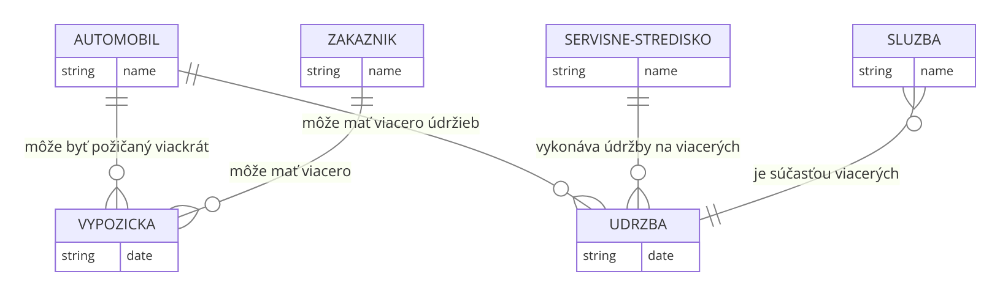
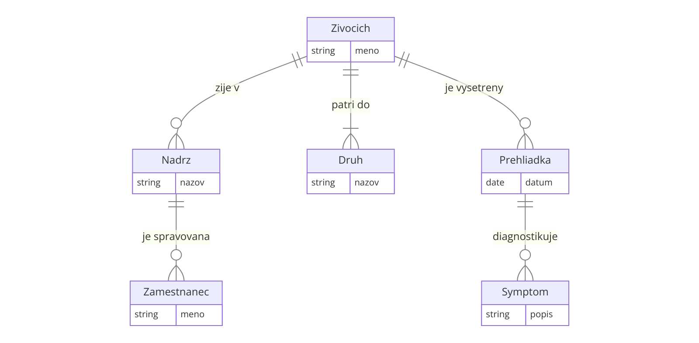

# Cviko 6 - Dátové modelovanie

#### Úloha 1.

Z logického E-R modelu vytvorte relačný model (fyzický model). Identifikujte potrebné entity, vzťahy medzi nimi, kardinalitu, definujte atribúty a ich typy, primárne a cudzie kľúče. Doplňte model tak, aby umožňoval lepšiu evidenciu jednotlivých zákaziek a množstvo spotrebovaného materiálu.
Doplňte model tak, aby umožňoval lepšiu evidenciu jednotlivých zákaziek a množstvo spotrebovaného materiálu.


**Entity:**
- Zákazník
- Objednávka
- Položka objednávky
- Odev
- Materiál

**Vzťahy:**

- Položkou objednávky a Odevom (M:N):
    - Entita: Odev_Položka
    - Táto spojovacia entita umožňuje, že viac odevov môže byť súčasťou viacerých položiek objednávok a naopak.
- Odevom a Materiálom (M:N):
    - Entita: Odev_Materiál
    - Táto spojovacia entita umožňuje evidenciu spotrebovaného materiálu pre každý odev.

#### Úloha 2.

Doplňte model tak, aby zobrazoval históriu pôsobení hráča v tímoch a možnosť sledovania štatistík jednotlivých hráčov.


#### Úloha 3.

Uvažujte spoločnosť na požičiavanie automobilov. Táto spoločnosť poskytuje niekoľko automobilov rôznych značiek a modelov. Zákazník si môže požičať automobil na dobu určitú. Spoločnosť si eviduje výnosy z výpožičiek. Automobil vyžaduje poistenie a údržbu. Údržbu automobilov zabezpečujú servisné strediská. Tieto strediská poskytujú rôzne služby, pričom dve rozdielne strediská môžu poskytovať rovnakú službu za rozdielnu cenu. Spoločnosť si eviduje náklady na údržbu automobilov.
Vytvorte najskôr logický E-R model, identifikujte entity, vzťahy medzi entitami a nakreslite ER diagram. Pre tento model vytvorte fyzický relačný model, pre ktorý identifikujte potrebné entity, vzťahy medzi nimi, kardinalitu, definujte atribúty a ich typy, primárne a cudzie kľúče.

**Entity**
- Automobil
- Zákazník
- Výpožička
- Servisné Stredisko
- Údržba
- Služba

**Vzťahy**

- Automobil - Výpožička
    - Automobil môže byť požičaný viackrát, zákazník môže požičať viacero automobilov.
    - Kardinalita: M:N
- Zákazník - Výpožička
    - Zákazník môže mať viacero výpožičiek, jedna výpožička patrí jednému zákazníkovi.
    - Kardinalita: 1:N
- Automobil - Údržba
    - Na jednom automobile sa môže vykonať viacero údržieb.
    - Kardinalita: 1:N
- Servisné Stredisko - Údržba
    - Jedno servisné stredisko môže vykonávať údržby na viacerých automobiloch.
    - Kardinalita: 1:N
- Služba - Údržba
    - Jedna služba môže byť súčasťou viacerých údržieb.
    - Kardinalita: M:N (prepojené cez Údržba)



**Fyzický Relačný Model**
```sql
Automobil
    ID_Automobilu INT PRIMARY KEY
    Značka VARCHAR
    Model VARCHAR
    Poistka VARCHAR
Zákazník
    ID_Zákazníka INT PRIMARY KEY
    Meno VARCHAR
    Priezvisko VARCHAR
    Telefónne_číslo VARCHAR
Výpožička
    ID_Výpožičky INT PRIMARY KEY
    Dátum_začiatku DATE
    Dátum_konca DATE
    Cena DECIMAL
    ID_Automobilu INT, FOREIGN KEY REFERENCES Automobil(ID_Automobilu)
    ID_Zákazníka INT, FOREIGN KEY REFERENCES Zákazník(ID_Zákazníka)
Servisné Stredisko
    ID_Strediska INT PRIMARY KEY
    Názov VARCHAR
    Adresa VARCHAR
Údržba
    ID_Údržby INT PRIMARY KEY
    Dátum DATE
    Cena DECIMAL
    ID_Automobilu INT, FOREIGN KEY REFERENCES Automobil(ID_Automobilu)
    ID_Strediska
```


#### Úloha 4.

V diagrame je zobrazený zjednodušený logický entitno-relačný model letiska.
* A: Vytvorte z tohto modelu fyzický relačný model. Identifikujte potrebné entity, ich vzťahy, a správne do neho umiestnite primárne a cudzie kľúče. Ďalšie atribúty môžete pri riešení zanedbať.
* B: Zaveďte do modelu entitu letenky, na základe ktorej pasažier cestuje z počiatočného letiska do svojho cieľa. Uvažujte pritom aj možnosť, že aj po vydaní boarding passu môže byť let zrušený, a pasažier bude musieť cestovať odlišným letom.


#### Úloha 5.

Uvažujme morské akvárium, ktoré návštevníkom umožňuje z blízka sledovať život pod morskou hladinou. Akvárium disponuje mnohými nádržami, z ktorých každá nádrž má rôzny objem a teplotu vody. Pre účely údržby akvárium tiež eviduje, či je nádrž napustená. Každá nádrž má svojho správcu z radov zamestnancov, ktorý v danej nádrži riadi čistenie a kŕmenie, a dozerá na celkový stav zvierat v nádrži. V každej nádrži môže byť umiestnený ľubovoľný počet živočíchov rôznych druhov. Každý živočích je identifikovaný podľa mena a tiež 10- znakového kódu čipu, ktorým je označený. O všetkých živočíchoch akvárium eviduje ich dátum narodenia, a či boli narodení v zajatí. Každý živočíšny druh má o sebe evidovaný názov, latinský názov, a tiež dlhší opis zobrazovaný návštevníkom na informačných tabuliach. Živočíchy môžu byť premiestňované medzi jednotlivými nádržami - napríklad pri čistení celej nádrže - a preto akvárium musí evidovať odkedy a dokedy sa kde ktorý živočích nachádzal. Živočíchy v akváriu musia z času na čas prejsť veterinárnou prehliadkou. Prehliadky uskutočňuje vždy jeden z veterinárov zamestnaných v akváriu. Na základe prehliadky môže byť živočíchovi diagnostikovaný určitý symptóm, ktorý má svoj názov a textový opis. K diagnóze je následne evidovaný fakt, či sa z nej živočích úspešne vyliečil.
  
Vytvorte najskôr logický E-R model, identifikujte entity, vzťahy medzi entitami a nakreslite ER diagram. Pre tento model vytvorte fyzický relačný model, pre ktorý identifikujte potrebné entity, vzťahy medzi nimi, kardinalitu, definujte atribúty a ich typy, primárne a cudzie kľúče.

**Entity a atribúty:**
- Nádrž
    - ID nádrže (Primárny kľúč)
    - Objem (číselný)
    - Teplota vody (číselný)
    - Stav (boolean - napustená/nenapustená)
    - Správca (cudzí kľúč na Zamestnanec)
- Zamestnanec (Správca)
    - ID zamestnanca (Primárny kľúč)
    - Meno (textový)
    - Pozícia (textový)
- Živočích
    - Meno (textový)
    - Kód čipu (textový, 10 znakov, Primárny kľúč)
    - Dátum narodenia (dátumový)
    - Narodený v zajatí (boolean)
    - Druh (cudzí kľúč na Druh)
- Druh
    - Názov (textový, Primárny kľúč)
    - Latinský názov (textový)
    - Opis (textový)
- Symptóm
    - Názov symptómu (textový, Primárny kľúč)
    - Opis (textový)
- Prehliadka
    - ID prehliadky (primárny kľúč)
    - Dátum prehliadky
    - Veterinár (cudzí kľúč na Zamestnanec)
    - Živočích (cudzí kľúč na Živočích)

**Vzťahy:**

- Nádrž je spravovaná Zamestnancom
    - (1:N) 
    - Každá nádrž má jedného správcu, zamestnanec môže spravovať viacero nádrží.
- Živočích žije v Nádrži 
    - (N:M) 
    - Živočíchy môžu byť premiestňované medzi nádržami, a preto evidujeme intervaly ich pobytu v jednotlivých nádržiach.
- Živočích patrí do Druhu 
    - (N:1) 
    - Každý živočích patrí do určitého druhu.
- Živočích je vyšetrený Prehliadkou 
    - (N:M) 
    - Živočíchy môžu podstúpiť viacero prehliadok, a jedna prehliadka môže zahŕňať viacero živočíchov.
- Prehliadka diagnostikuje Symptóm 
    - (N:M) 
    - Počas jednej prehliadky môže byť diagnostikovaných viacero symptómov, a jeden symptóm môže byť diagnostikovaný pri viacerých prehliadkach.

