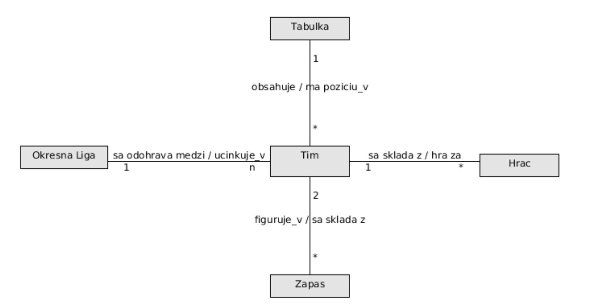

# Cviko 6 - Dátové modelovanie

#### Uloha 1.

Z logického E-R modelu vytvorte relačný model (fyzický model). Identifikujte potrebné entity, vzťahy medzi nimi, kardinalitu, definujte atribúty a ich typy, primárne a cudzie kľúče. Doplňte model tak, aby umožňoval lepšiu evidenciu jednotlivých zákaziek a množstvo spotrebovaného materiálu.
Doplňte model tak, aby umožňoval lepšiu evidenciu jednotlivých zákaziek a množstvo spotrebovaného materiálu.

#### Uloha 2.

Doplňte model tak, aby zobrazoval históriu pôsobení hráča v tímoch a možnosť sledovania štatistík jednotlivých hráčov.

#### Uloha 3.

Uvažujte spoločnosť na požičiavanie automobilov. Táto spoločnosť poskytuje niekoľko automobilov rôznych značiek a modelov. Zákazník si môže požičať automobil na dobu určitú. Spoločnosť si eviduje výnosy z výpožičiek. Automobil vyžaduje poistenie a údržbu. Údržbu automobilov zabezpečujú servisné strediská. Tieto strediská poskytujú rôzne služby, pričom dve rozdielne strediská môžu poskytovať rovnakú službu za rozdielnu cenu. Spoločnosť si eviduje náklady na údržbu automobilov.
Vytvorte najskôr logický E-R model, identifikujte entity, vzťahy medzi entitami a nakreslite ER diagram. Pre tento model vytvorte fyzický relačný model, pre ktorý identifikujte potrebné entity, vzťahy medzi nimi, kardinalitu, definujte atribúty a ich typy, primárne a cudzie kľúče.

#### Uloha 4.

V diagrame je zobrazený zjednodušený logický entitno-relačný model letiska.
* A: Vytvorte z tohto modelu fyzický relačný model. Identifikujte potrebné entity, ich vzťahy, a správne do neho umiestnite primárne a cudzie kľúče. Ďalšie atribúty môžete pri riešení zanedbať.
* B: Zaveďte do modelu entitu letenky, na základe ktorej pasažier cestuje z počiatočného letiska do svojho cieľa. Uvažujte pritom aj možnosť, že aj po vydaní boarding passu môže byť let zrušený, a pasažier bude musieť cestovať odlišným letom.

#### Uloha 5.

Uvažujme morské akvárium, ktoré návštevníkom umožňuje z blízka sledovať život pod morskou hladinou. Akvárium disponuje mnohými nádržami, z ktorých každá nádrž má rôzny objem a teplotu vody. Pre účely údržby akvárium tiež eviduje, či je nádrž napustená. Každá nádrž má svojho správcu z radov zamestnancov, ktorý v danej nádrži riadi čistenie a kŕmenie, a dozerá na celkový stav zvierat v nádrži. V každej nádrži môže byť umiestnený ľubovoľný počet živočíchov rôznych druhov. Každý živočích je identifikovaný podľa mena a tiež 10- znakového kódu čipu, ktorým je označený. O všetkých živočíchoch akvárium eviduje ich dátum narodenia, a či boli narodení v zajatí. Každý živočíšny druh má o sebe evidovaný názov, latinský názov, a tiež dlhší opis zobrazovaný návštevníkom na informačných tabuliach. Živočíchy môžu byť premiestňované medzi jednotlivými nádržami - napríklad pri čistení celej nádrže - a preto akvárium musí evidovať odkedy a dokedy sa kde ktorý živočích nachádzal. Živočíchy v akváriu musia z času na čas prejsť veterinárnou prehliadkou. Prehliadky uskutočňuje vždy jeden z veterinárov zamestnaných v akváriu. Na základe prehliadky môže byť živočíchovi diagnostikovaný určitý symptóm, ktorý má svoj názov a textový opis. K diagnóze je následne evidovaný fakt, či sa z nej živočích úspešne vyliečil.
  
Vytvorte najskôr logický E-R model, identifikujte entity, vzťahy medzi entitami a nakreslite ER diagram. Pre tento model vytvorte fyzický relačný model, pre ktorý identifikujte potrebné entity, vzťahy medzi nimi, kardinalitu, definujte atribúty a ich typy, primárne a cudzie kľúče.