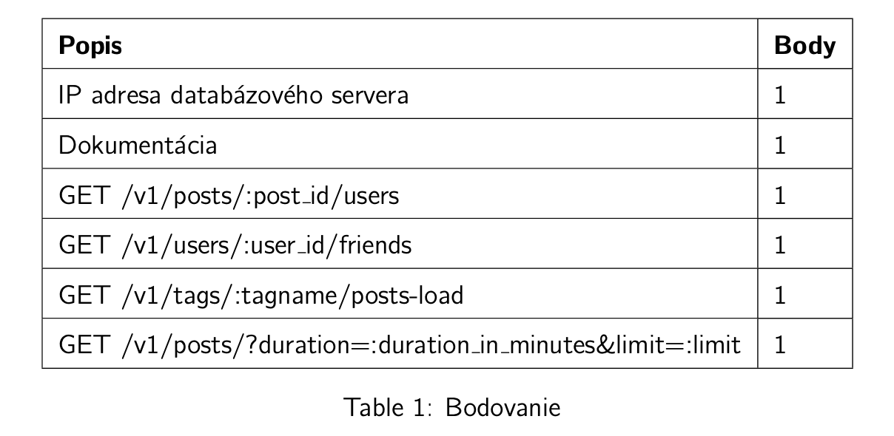

# Zadanie 2

* pokračovanie zadania 1
* import "Stack Exchange Data Dump Superuser" datasetu do vašej lokálnej databázy
* vytvorenie nových http endpointov podľa zadania
* http -> sql -> json
* **IBA SQL, ŽIADNE ORM** 
* Pri odpovediach je potrebné vrátiť časy vo formáte ISO8601 v UTC
* **PROTOKOL** (pdf alebo markdown)
    * SQL dopyty s ich opisom
    * príklady volania HTTP endpointov (pre každý endpoint)

### Bodovanie




### HTTP endpointy

#### [GET] /v2/posts/:post id/users

Vráťte zoznam všetkých diskutujúcich (users) príspevku (posts) s ID :post_id, pričom ich usporiadajte v závislosti od času vytvorenia ich komentára, začínajúc od najnovších a končiac najstaršími.
JSON schéma HTTP odpovede sa nachádza v súbore schemas/users.json.

---------
- unique users!

```sql
SELECT u.*,
       max(c.creationdate) first_comment_date
FROM comments c
JOIN posts p ON p.id = c.postid
JOIN users u ON c.userid = u.id
WHERE p.id = 1014866
GROUP BY u.id,
         reputation,
         u.creationdate,
         displayname,
         lastaccessdate,
         websiteurl,
         LOCATION,
         aboutme,
         VIEWS,
         upvotes,
         downvotes,
         profileimageurl,
         age,
         accountid
ORDER BY first_comment_date DESC;
```

#### [GET] /v2/users/:user id/friends

Vypracujte zoznam diskutujúcich pre používateľa s ID "user_id", obsahujúci používateľov, ktorí komentovali príspevky, ktoré daný používateľ založil alebo na ktorých komentoval. Usporiadajte používateľov v závislosti od dátumu ich registrácie, začínajúc s tými, ktorí sa zaregistrovali ako prví. JSON schéma HTTP odpovede sa nachádza v súbore "schemas/users.json".

---------
```sql
SELECT DISTINCT u.*
FROM users u
INNER JOIN (
    SELECT c.userid
    FROM comments c
    WHERE c.postid IN (
        SELECT c2.postid
        FROM comments c2
        WHERE c2.userid = 233630
        UNION
        SELECT p.id
        FROM posts p
        WHERE p.owneruserid = 233630
    )
) AS filtered_users ON u.id = filtered_users.userid
ORDER BY u.creationdate ASC;
```

#### [GET] /v2/tags/:tagname/stats

Určte, aké percentuálne zastúpenie majú príspevky s konkrétnym tagom v rámci celkového počtu príspevkov vydaných v jednotlivých dňoch týždňa (napríklad pondelok, utorok), a to pre každý deň týždňa zvlášť. Výsledky ukážte na škále od 0 - 100 a zaokrúhlite na dve desatinné miesta.

---------
```sql
SELECT
	creation_day,
	ROUND((SUM(is_html)::float / COUNT(*)::float * 100)::numeric, 2) AS percentage
FROM (
	SELECT 
		to_char(posts.creationdate, 'day') AS creation_day,
		('linux' = ANY(array_agg(tags.tagname)))::integer AS is_html
	FROM posts
		LEFT JOIN post_tags ON (posts.id = post_tags.post_id)
		LEFT JOIN tags ON (post_tags.tag_id = tags.id)
	GROUP BY posts.id
)
GROUP BY creation_day
ORDER BY creation_day;  
```

**4% results ->**  
friday   	4.67  
monday   	4.71  
saturday 	4.98  
sunday   	4.88  
thursday 	4.57  
tuesday  	4.69  
wednesday	4.63  

#### [GET] /v2/posts/?duration=:duration in minutes&limit=:limit

Výstupom je zoznam :limit najnovších vyriešených príspevkov, ktoré boli otvorené maximálne :duration in minutes minút (počet minút medzi creationdate a closeddate). Trvanie otvorenia (duration) zaokrúhlite na dve desatinné miesta.

---------
```sql
SELECT
	posts.id,
	posts.creationdate,
	posts.viewcount,
	posts.lasteditdate,
	posts.lastactivitydate,
	posts.title,
	posts.closeddate,
	ROUND(EXTRACT(EPOCH FROM (posts.closeddate - posts.creationdate)) / 60, 2) AS duration
FROM posts 
WHERE
	posts.closeddate IS NOT NULL AND posts.closeddate - posts.creationdate < INTERVAL '5 MINUTE'
ORDER BY posts.creationdate DESC
LIMIT 10
```

#### [GET] /v2/posts?limit=:limit&query=:query

Navrhnite koncový bod (endpoint), ktorý poskytne zoznam príspevkov usporiadaných od najnovších po najstaršie. Súčasťou odpovede je aj kompletný zoznam priradených tagov. Tento koncový bod podporuje dva parametre:

- limit: maximálny počet príspevkov v odpovedi,
- query: reťazec na vyhľadávanie nad posts.title a posts.body.
---------
* Vyhľadávanie nie je citlivé na diakritiku a malé/veľké písmená.  
* Kompletný zoznam priradených tagov!

```sql
SELECT posts.id,
       posts.creationdate,
       posts.viewcount,
       posts.lasteditdate,
       posts.lastactivitydate,
       posts.title,
       posts.body,
       posts.answercount,
       posts.closeddate,
       array_agg(tags.tagname) AS tags
FROM posts
LEFT JOIN post_tags ON (posts.id = post_tags.post_id)
LEFT JOIN tags ON (post_tags.tag_id = tags.id)
WHERE lower(unaccent(CONCAT(posts.title, ';', posts.body))) ILIKE unaccent('%linux%')
GROUP BY posts.id
ORDER BY posts.creationdate DESC
LIMIT 10;
```