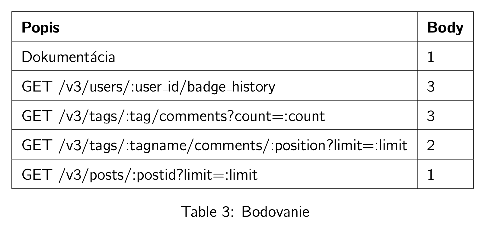

# Zadanie 3

* pokračovanie zadania 2 na datach z  "Stack Exchange Data Dump Superuser"
* vytvorenie nových http endpointov podľa zadania
* http -> sql -> json
* **IBA SQL, ŽIADNE ORM** 
* Pri odpovediach je potrebné vrátiť časy vo formáte ISO8601 v UTC
* **PROTOKOL** (pdf alebo markdown)
    * SQL dopyty s ich opisom
    * príklady volania HTTP endpointov (pre každý endpoint)
* Vo výstupe môžu nastať drobné nezrovnalosti (‘Z‘ / ‘+00:00‘ alebo nepresnosti na  úrovni ms)
* Pri riešení je zakázané používať klúčové slovo WITH (úloha bude vyhodnotená za 0 bodov).

### Bodovanie

### HTTP endpointy

#### [GET] /v3/users/:user id/badge history

#### [GET] /v3/tags/:tag/comments?count=:count

#### [GET] /v3/tags/:tagname/comments/:position?limit=:limit

#### [GET] /v3/posts/:postid?limit=:limit
